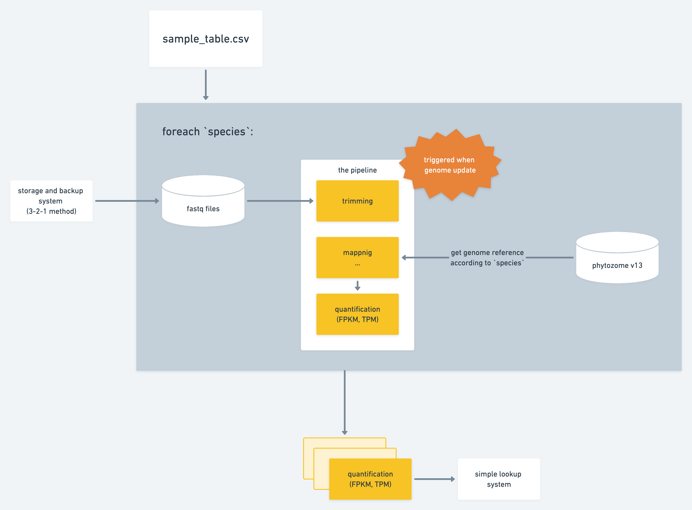

# RNA-Seq analysis on sapelo2 at UGA

Tsai lab RNA-Seq script

## Description

RNA-Seq runs transcriptomic analysis. The input of this pipeline is a csv file. So to begin, prepare a sample table with the schema like `sample_table.csv`. This script will then run the RNA-Seq pipeline on the samples from different species in the table.

Here's how the pipeline flows:



It will create folder structure like:

```
{species_id}
    fastq (raw fastq files)
    reference (genome reference from Phytozome or other sources)
        species_genome.fasta -> genome.fa
        species_annotation.gff3 -> gene.gtf
    clean (filtered reads)
    map (alignment maps)
    count (quantification results for further analysis)
    misc (other intermediate files)
        *.txt
        log....
```

## In-house Resources

the pollen fastq files’ path: `strawberry:~/ChenHsieh/pollen_rnaseq`

the complete Phytozome zipped file: `/home/tsailab1/chenhsieh/pep/Phytozome_download.zip`


## Instructions to Run
1. create input csv file (like `sample_input`), name it `input.csv`, and add it to `RNA-Seq/input/
2. clone this repo
```bash
git clone https://github.com/TsailabBioinformatics/RNA-Seq.git;cp RNA-Seq/* .
```
- if cloning returned `fatal: Authentication failed`, then try again using a github personal access token. instructions to do so can be found here: <https://docs.github.com/en/enterprise-server@3.1/authentication/keeping-your-account-and-data-secure/creating-a-personal-access-token>
4. once cloned, change directories into `RNA-Seq`
5. load modules `python-utils` and `pandas` with commands:
```bash
ml python-utils
```
```bash
ml pandas
```
7. run th pipeline
```python3
python3 pipeline.py
```
